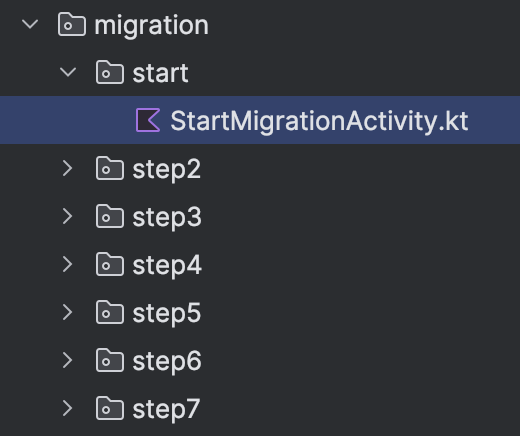
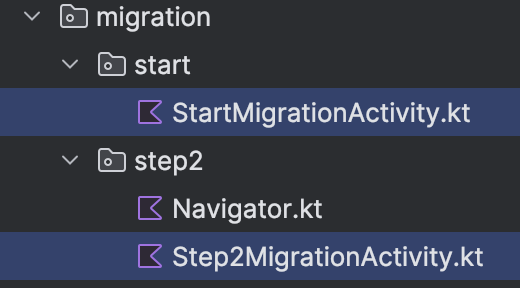
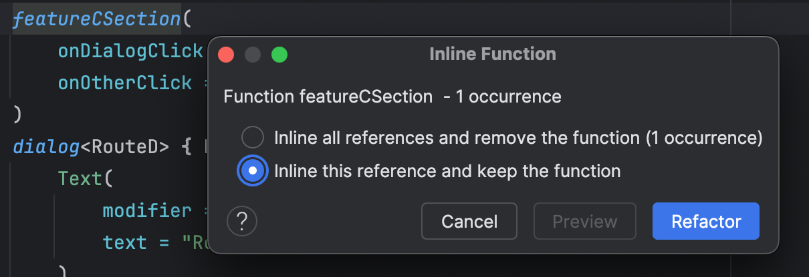

# Navigation 2 to 3 migration guide
**IMPORTANT:** This document is a 🚧work in progress🚧 and as such care should be taken when implementing the steps in this guide
in your own app. We welcome your feedback! For details on how to provide feedback see [this discussion](https://github.com/android/nav3-recipes/discussions/91).

## Overview 

This is intended to be a general guide to [Navigation 2](https://developer.android.com/guide/navigation) to [Navigation 3](https://developer.android.com/guide/navigation/navigation-3) migration which can be applied to any project. It attempts to keep the project in a working state during migration (build succeeds, navigation tests pass) and does this by maintaining interoperability between Nav2 and Nav3.

The guide assumes that the project is [modularized](https://developer.android.com/topic/modularization), and the suggested approach allows feature modules to adopt Nav3 on an incremental basis. Once all feature modules have migrated, the Nav2 code can be safely removed. If the codebase is not modularized, the steps for specific modules should be applied to the main `app` module.

### Features 

This guide covers the migration of the following Nav2 features:

- Nested navigation graphs - single level of nesting only
- Shared destinations - ones that can appear in different navigation graphs
- Dialog destinations

The following features are not yet supported:

- More than one level of nested navigation
- [Custom destination types](https://developer.android.com/guide/navigation/design/kotlin-dsl#custom)
- Deeplinks

### Prerequisites 

- Familiarity with [navigation terminology](https://developer.android.com/guide/navigation).
- Destinations are Composable functions. Nav3 is designed exclusively for Compose. Fragment destinations can be wrapped with [`AndroidFragment`](https://developer.android.com/reference/kotlin/androidx/fragment/compose/package-summary#AndroidFragment(androidx.compose.ui.Modifier,androidx.fragment.compose.FragmentState,android.os.Bundle,kotlin.Function1)) for interoperability with Compose.
- Routes are strongly typed. If you are using string-based routes, [migrate to type-safe routes](https://medium.com/androiddevelopers/type-safe-navigation-for-compose-105325a97657) first ([example](https://github.com/android/nowinandroid/pull/1413)).
- Optional but highly recommended: test coverage that verifies existing navigation behavior. These will ensure that during migration, navigation behavior is not changed. See [here for an example of navigation tests](https://github.com/android/nav3-recipes/blob/main/app/src/androidTest/java/com/example/nav3recipes/MigrationActivityNavigationTest.kt).
- Your app must have a [minSdk](https://developer.android.com/guide/topics/manifest/uses-sdk-element#min) of 23 or above.

### Step-by-step code examples 

A [migration recipe](https://github.com/android/nav3-recipes/tree/main/app/src/main/java/com/example/nav3recipes/migration) exists to accompany this guide. It starts with an activity containing only Nav2 code. The end state of each migration step is represented by another activity. Instrumented tests verify the navigation behavior in every step.

To use the migration recipe as a guide:

- Clone the [nav3-recipes repository](https://github.com/android/nav3-recipes), load it into Android Studio and switch to the Android view in the project explorer
- Expand the `com.example.nav3recipes.migration` package
- Open `start.StartMigrationActivity`. Familiarise yourself with the navigation structure and behavior defined in this activity. For simplicity, the recipe codebase is not modularized, however, it is structured in a way that should make it clear where the module boundaries would be in a real app. This is the starting point for migration.



- Open `MigrationActivityNavigationTest` which is under the `androidTest` source set. This file contains the instrumented tests that verify the navigation behavior.
- Run the tests. Note that the tests are run on every migration step activity.

Tips for working with the migration recipe:

- It can be useful to see the differences between migration steps. To do this, highlight both files in Android Studio project explorer then right click and choose "Compare files". The first file to be selected is the one that will appear in the left window pane.



- To run the migration tests only on a single activity, uncomment the other activities in the `data` function inside `MigrationActivityNavigationTest`.
- The migration steps introduce a `Navigator` class. Setting its `shouldPrintDebugInfo` parameter to `true` will output lots of debug information to Logcat.

## Step 1. Add the Nav3 dependencies 

The latest dependencies can be found here: [https://developer.android.com/guide/navigation/navigation-3/get-started](https://developer.android.com/guide/navigation/navigation-3/get-started)

- Update `lib.versions.toml` to include the Nav3 dependencies. Use the [latest version from here](https://developer.android.com/jetpack/androidx/releases/navigation3).

```
androidxNavigation3 = "1.0.0-alpha10"
androidx-navigation3-runtime = { module = "androidx.navigation3:navigation3-runtime", version.ref = "androidxNavigation3" }
androidx-navigation3-ui = { module = "androidx.navigation3:navigation3-ui", version.ref = "androidxNavigation3" }
```

### 1.1 Create a common navigation module 

- If you don't have one already, create a `:core:navigation` module
- Add the Nav3 runtime as a dependency using `api(libs.androidx.navigation3.runtime)`. This allows modules depending on `:core:navigation` to use the Nav3 runtime API.
- Add the Nav2 dependencies. These will be removed once migration is complete.

Example `build.gradle.kts`:

```
dependencies {
    api(libs.androidx.navigation3.runtime)
    implementation(libs.androidx.navigation2)
}
```

**Note**: Nav3 has two libraries: `runtime` and `ui`. Usually only the `app` module needs to depend on `navigation3.ui` which is why it isn't included in the `:core:navigation` dependencies above.

### 1.2 Update main app module 

- Update the `app` module to depend on `:core:navigation` and on `androidx.navigation3.ui`
- Update compileSdk to 36 or above
- Update minSdk to 23 or above
- Update AGP to 8.9.3 or above

## Step 2. Create a back stack and use it with NavDisplay 

### 2.1 Add the Navigator class 

Important: A fundamental difference between Nav2 and Nav3 is that **you own the back stack**. This means much of the logic and state that was previously managed by Nav2, must now be managed by you. This gives you greater flexibility and control, but also more responsibility.

To aid with migration, a class which provides and manages a back stack named `Navigator` is provided for you. It is not part of the Nav3 library and it does not provide all the features of Nav2. Instead, it is intended to be an assistant during migration, and after to be a starting point for you to implement your own navigation behavior and logic.

Copy the [`Navigator`](https://github.com/android/nav3-recipes/blob/main/app/src/main/java/com/example/nav3recipes/migration/step2/Navigator.kt) to the `:core:navigation` module. This class contains `backStack: SnapshotStateList<Any>` that can be used with `NavDisplay`. It will mirror `NavController`'s back stack ensuring that Nav2's state remains the source of truth throughout migration. After the migration is complete, the NavController mirroring code will be removed.

### 2.2 Make the Navigator available everywhere that NavController is 

Goal: The `Navigator` class is available everywhere that `NavController` is used.

- Create the `Navigator` immediately after `NavController` is created

Example:

```
val navController = rememberNavController()
val navigator = remember { Navigator(navController) }
```

- Do a project-wide search for "NavController" and "NavHostController"
- Update any classes or methods that accept a `NavController` or `NavHostController` to also accept `Navigator` as a parameter

### 2.3 Add a `NavDisplay` on top of `NavHost` 

Goal: `NavDisplay` is displayed transparently on top of your existing `NavHost`

The idea here is to let `NavHost` render all the legacy routes and `NavDisplay` render migrated routes. When `NavDisplay` encounters a legacy route it will render nothing, allowing the original `NavHost` to render the route instead.

- Wrap your existing `NavHost` with a `Box`
- Add a `NavDisplay` inside the `Box` under the `NavHost`
- Pass your `Navigator`'s back stack to the `NavDisplay`
- Set `NavDisplay.onBack` to call `navigator.goBack()`
- Create an `entryProvider` with a `fallback` lambda that has no composable content causing the existing `NavHost` to be displayed

Example:

```
Box {
    NavHost(...)
    NavDisplay(
        backStack = navigator.backStack,
        onBack = { navigator.goBack() },
        entryProvider = entryProvider(
            fallback = { key ->
                NavEntry(key = key) {}
            }
        ) {
            // No nav entries added yet.
        }
    )
}
```

## Step 3. [Single feature] Migrate routes 

Goal: Routes are moved into their own `:feature:api` module and their properties are modelled outside of `NavHost`

### 3.1 Split feature module into api and impl 

Choose **a single feature module** that does not contain the start destination for your app. The feature module containing the start destination will be migrated last.

Create the `api` module:

- Create a new feature module named `:<existingfeaturename>:api`
- Move the routes into it
- Apply the KotlinX Serialization plugin to the module by updating the `build.gradle.kts`

Update the `:core:navigation` module:

- Add a dependency on `:<existingfeaturename>:api` - this allows `Navigator` to access the feature's routes. It is not good practice for `:core` modules to depend on `:feature` modules, however, this is necessary during migration. This dependency will be removed once migration is complete.

Create the `impl` module:

- Move the remaining contents of `:<existingfeaturename>` into `:<existingfeaturename>:impl`
- Add the following dependencies:
    - `:<existingfeaturename>:api` so it has access to the routes
    - `:core:navigation` so it has access to the Nav3 APIs and the `Navigator` class

Update `:app` dependencies:

- Update the `:app` module to depend on both `:<existingfeaturename>:api` and `:<existingfeaturename>:impl`.

### 3.2 Model nested navigation graphs 

Skip this section if you don't use nested navigation graphs.

#### 3.2.1 Nested graph migration overview

In Nav2, you can define nested navigation graphs using the `navigation` builder function inside `NavHost`. `NavController` provides a back stack for each nested graph. This allows you to have several top level destinations, each with sub-destinations. You can also define shared destinations - ones that are accessible from more than one navigation graph - by duplicating the destination in multiple graphs.

For example, the following code defines two nested navigation graphs, each containing a shared destination defined by `RouteE`.

```
@Serializable private data object BaseRouteA
@Serializable private data object RouteA
@Serializable private data object RouteA1
@Serializable private data object BaseRouteB
@Serializable private data object RouteB
@Serializable private data object RouteB1
@Serializable private data object RouteE

NavHost(startDestination = BaseRouteA){
    navigation<BaseRouteA>(startDestination = RouteA) {
        composable<RouteA> { ContentRed("Route A title") }
        composable<RouteA1> { ContentRed("Route A1 title") }
        composable<RouteE> { SharedScreen() }
    }
    navigation<BaseRouteB>(startDestination = RouteB) {
        composable<RouteB> { ContentRed("Route B title") }
        composable<RouteB1> { ContentRed("Route B1 title") }
        composable<RouteE> { SharedScreen() }
    }
}
```

In Nav3, how you model relationships between routes is up to you. In this migration guide, `NavHost` will be removed so it's important that the properties and relationships defined here are captured elsewhere.

One possible way of modelling these properties (though by no means the only way), is to define marker interfaces for the top level and shared routes.

```
@Serializable private data object RouteA : Route.TopLevel
@Serializable private data object RouteA1
@Serializable private data object RouteB : Route.TopLevel
@Serializable private data object RouteB1
@Serializable private data object RouteE : Route.Shared

sealed interface Route {
    interface TopLevel : Route
    interface Shared : Route
}
```

Once modelled, the nested navigation and shared destination behavior can be implemented as follows inside a class that provides a back stack, such as the provided `Navigator`.

#### For nested navigation

- Each top level route has its own back stack.
- The first element in that back stack is the top level route - this approach means we no longer need the `BaseRoute` objects to identify each nested navigation graph, the first element is sufficient.
- The current top level route is tracked and sub routes are added to its back stack - there is no explicit definition of parent-child relationships between routes
- When the top level route changes, other top level stacks can be retained or discarded.
- The top level stacks can be flattened into a single list which is observed by `NavDisplay`.

#### For shared routes

- When navigating to a route that implements `Route.Shared`, check whether it's already on a top level stack:
    - If so, move it to the current top level stack
    - If not, add it to the current top level stack

#### Example

Taking the code example from above. The starting route is A.

<table>
  <tr>
    <td><p><strong>User action</strong></p></td> 
    <td><p><strong>Current top level route</strong></p></td> 
    <td><p><strong>Top level stacks</strong></p></td> 
    <td><p><strong>Back stack</strong></p></td> 
    <td><p><strong>Notes</strong></p></td>
  </tr>
  <tr>
    <td><p>Open app</p></td> 
    <td><p>A</p></td> 
    <td><p>A => [A]</p></td> 
    <td><p>A</p></td> 
    <td></td>
  </tr>
  <tr>
    <td><p>Tap on A1</p></td> 
    <td><p>A</p></td> 
    <td><p>A => [A, A1]</p></td> 
    <td><p>A, A1</p></td> 
    <td></td>
  </tr>
  <tr>
    <td><p>Tap on B</p></td> 
    <td><p>B</p></td> 
    <td><p>A => [A, A1]</p><p>B => [B]</p></td> 
    <td><p>A, A1, B</p></td> 
    <td></td>
  </tr>
  <tr>
    <td><p>Tap on B1</p></td> 
    <td><p>B</p></td> 
    <td><p>A => [A, A1]</p><p>B => [B, B1]</p></td> 
    <td><p>A, A1, B, B1</p></td> 
    <td></td>
  </tr>
  <tr>
    <td><p>Tap on E</p></td> 
    <td><p>B</p></td> 
    <td><p>A => [A, A1]</p><p>B => [B, B1, E]</p></td> 
    <td><p>A, A1, B, B1, E</p></td> 
    <td></td>
  </tr>
  <tr>
    <td><p>Tap on A</p></td> 
    <td><p>A</p></td> 
    <td><p>A => [A, A1]</p></td> 
    <td><p>A, A1</p></td> 
    <td><p>We make the decision to pop all B's routes from the stack, this is similar to using <code>popUpTo(A)</code> when navigating using Nav2</p></td>
  </tr>
  <tr>
    <td><p>Tap on E</p></td> 
    <td><p>A</p></td> 
    <td><p>A => [A, A1, E]</p></td> 
    <td><p>A, A1, E</p></td> 
    <td></td>
  </tr>
</table>

##### Steps

Review the provided `Navigator` class to ensure that it can model your app's current navigation behavior. In particular:

- Review the [`add method`](https://github.com/android/nav3-recipes/blob/main/app/src/main/java/com/example/nav3recipes/migration/step2/Navigator.kt#L142)
- Note that `popUpTo` in the [`navigate`](https://github.com/android/nav3-recipes/blob/main/app/src/main/java/com/example/nav3recipes/migration/step7/Navigator.kt#L121) will be ignored when switching to Nav3 in the final step. There is no equivalent to `popUpTo` in Nav3 because you control the back stack. The supplied `Navigator` class does, however, include logic to pop all top level stacks up to the starting stack when navigating to a new top level route. This behavior can be toggled using `canTopLevelRoutesExistTogether`.

#### 3.2.2 Update routes to implement marker interfaces

Steps:

- Update each top level route so that it implements the `Route.TopLevel` interface provided by `Navigator.kt`
- Update each shared route so that it implements the `Route.Shared` interface provided by `Navigator.kt`

## Step 4. [Single feature] Move destinations from NavHost to entryProvider 

Goal: When navigating to a migrated route, it is provided using `NavDisplay`'s `entryProvider`.

### 4.1 Move composable content from NavHost into entryProvider 

Continue only with the feature module being migrated in the previous step.

#### 4.1.1 Move directly defined destinations, such as composable

For each destination inside `NavHost`, do the following based the destination type:

- `navigation` - do nothing
- `composable<T>` - Copy the function into `entryProvider` and rename `composable` to `entry`, retaining the type parameter. Remove the composable content from the old `composable<T>` leaving it empty i.e., `composable<T>{}`.
- `dialog<T>` - Same as composable but add metadata to the entry as follows: `entry<T>(metadata = DialogSceneStrategy.dialog()`)
    - If you haven't already, add `DialogSceneStrategy` to `NavDisplay`'s `sceneStrategy` parameter.
- [`bottomSheet`](https://developer.android.com/reference/kotlin/androidx/compose/material/navigation/package-summary#(androidx.navigation.NavGraphBuilder).bottomSheet(kotlin.String,kotlin.collections.List,kotlin.collections.List,kotlin.Function2)) - [Follow the bottom sheet recipe here](https://github.com/android/nav3-recipes/pull/67). This essentially the same as the instructions for `dialog` except that `BottomSheetSceneStrategy` is not part of the core Nav3 library and so should be copied/modified to your individual requirements.

#### 4.1.2 Obtain navigation arguments

In Nav2, when navigation arguments are passed using the route instance, you must first obtain the route instance from `NavBackStackEntry` by calling `toRoute`. In Nav3, the route instance is directly accessible with `entry`'s lambda parameter so there's no need to obtain the route instance.

If using ViewModels to pass navigation arguments, please check the [Nav3 recipes for ViewModels](https://github.com/android/nav3-recipes/blob/main/README.md#passing-navigation-arguments-to-viewmodels) and apply the technique most appropriate to your codebase.

#### 4.1.3 Code example

Existing code:

```
NavHost(...){
    navigation<BaseRouteB>(startDestination = RouteB) {
        composable<RouteB>{ entry -> 
            val id = entry.toRoute<RouteB>().id
            Text("Route B, id: $id") 
        }
        dialog<RouteD> { Text ("Dialog D") }
    }
}
```

New code:

```
NavHost(...){
    navigation<BaseRouteB>(startDestination = RouteB) {
        composable<RouteB>{}
        dialog<RouteD> {}
    }
}

NavDisplay(..., 
    sceneStrategy = remember { DialogSceneStrategy() },
    entryProvider = entryProvider {
        entry<RouteB>{ route -> Text("Route B, id: ${route.id}") }
        entry<RouteD>(metadata = DialogSceneStrategy.dialog()) { Text ("Dialog D") }
    }
)
```

#### 4.2.1 Move NavGraphBuilder extension functions

[`NavGraphBuilder`](https://developer.android.com/guide/navigation/design/encapsulate) [extension functions](https://developer.android.com/guide/navigation/design/encapsulate) can be refactored to `EntryProviderBuilder` extension functions. These functions can then be called inside `entryProvider`.

Refactoring `NavHost`:

- Copy the function call into `entryProvider`
- Inline the original function reference and keep the existing function



- Remove any composable content associated with the entries inside `NavHost`. Keeping blank entries for each route ensures that `NavController`'s back stack is still the source of truth for the navigation state.

Refactoring the extension function:

- Change the method signature from `NavGraphBuilder.existingScreen()` to `EntryProviderBuilder<Any>.existingScreen()`.
- Remove `navigation` destinations, leaving only the destinations they contain.
- Replace `composable` and `dialog` destinations with `entry`
    - For `dialog` destinations add the dialog metadata following the instructions in the previous step

#### 4.2.2 Code example

Existing code:

```
NavHost(...) {
    featureBSection()
}

private fun NavGraphBuilder.featureBSection(onDetailClick: () -> Unit) {
    navigation<BaseRouteB>(startDestination = RouteB) {
        composable<RouteB> { ContentRed("Route B title") }
    }
}
```

New code:

```
NavHost(...) {
    navigation<BaseRouteB>(startDestination = RouteB) {
        composable<RouteB> { }
    }
}

NavDisplay(..., entryProvider = entryProvider {
    featureBSection()
})

private fun EntryProviderBuilder<Any>.featureBSection() {
    entry<RouteB> { ContentRed("Route B title") }
}
```

### 4.3 In Navigator, convert NavBackStackEntry back to its route instance 

Steps:

- Locate the line starting `val route` in `Navigator`.
- Add an `if` branch for each migrated route that converts the `NavBackStackEntry` into a route instance using `NavBackStackEntry.toRoute<MigratedRouteType>`. For example:

```
val route =
   if (destination.hasRoute<RouteB>()) {
       entry.toRoute<RouteB>()
   } else if (destination.hasRoute<RouteB1>()) {
       entry.toRoute<RouteB1>()
   } else {
       // Non migrated route
       entry
   }
```

You should now be able to navigate to, and back from, the migrated destinations. These destinations will be displayed directly inside `NavDisplay` rather than by `NavHost`.

**Note**: When navigating (both forward and back) between destinations handled by `NavHost` and `NavDisplay`, you may see the blank destination until the transition animation has completed.

## Step 5. [Single feature] Replace NavController with Navigator  

Goal: Within the migrated feature module, navigation events are handled by `Navigator` instead of `NavController`

Steps:

- Replace `NavController.popBackStack` with `Navigator.goBack`
- Replace `NavController.navigate` with `Navigator.navigate`

Note: Take a look at how `navOptions` is handled in `Navigator`, you'll need to modify this behavior if it doesn't suit your requirements. 

For `NavController` extension functions defined by **other modules**:

- Inline the function, leaving the other module's function in place
- Make the replacements above

Remove Nav2 imports and module dependencies:

- Remove all imports starting with `import androidx.navigation`
- Remove feature module dependencies on `androidx.navigation`

At this point, this feature module has been fully migrated to Nav3.

## Step 6. Migrate all feature modules  

Goal: Feature modules use Nav3. They don't contain any Nav2 code.

Complete steps 3-5 for each feature module. Start with the module with the least dependencies and end with the module that contains the start route.

Ensure that shared entries are not duplicated.

## Step 7. Use `Navigator.backStack` as source of truth for navigation state 

### 7.1 Ensure `Navigator` is used instead of `NavController` everywhere 

Replace any remaining instances of:

- `NavController.navigate` with `Navigator.navigate`
- `NavController.popBackStack` with `Navigator.goBack`

### 7.2 Update Navigator to modify its back stack directly 

- Open `Navigator`
- In `navigate` and `goBack`:
    - Remove the code that calls `NavController`
    - Uncomment the code that modifies the back stack directly
- Remove all code which references `NavController`

The final `Navigator` [should look like this](https://github.com/android/nav3-recipes/blob/main/app/src/main/java/com/example/nav3recipes/migration/step7/Navigator.kt#L15).

### 7.3 Set the app's start route 

When creating the `Navigator` specify the starting route for your app.

```
val navigator = remember { Navigator(navController, startRoute = RouteA) }
```

### 7.4 Update common navigation UI components 

If using a common navigation component, such as a `NavBar`, change the logic for when a top level route is selected to use `Navigator.topLevelRoute`. [See example here](https://github.com/android/nav3-recipes/blob/main/app/src/main/java/com/example/nav3recipes/migration/step7/Step7MigrationActivity.kt#L94).

In Nav2, it was necessary to have a type for both the navigation graph and the start destination of that graph (e.g. `BaseRouteA` and `RouteA`). This is no longer necessary so remove any redundant types for the navigation graph from the `:api` modules. Ensure that the correct types are used to identify top level routes.

### 7.5 Remove the entryProvider fallback 

Remove the `fallback` parameter from `entryProvider` as there are no longer any unmigrated routes that must be handled by `NavHost`.

### 7.6. Remove unused dependencies 

- Remove all remaining Nav2 dependencies from the project
- In `:core:navigation` remove any dependencies on `:feature:api` modules

Congratulations! Your project is now migrated to Navigation 3.

## Next steps 

In the supplied `Navigator`, the type of items in the back stack is `Any`. You may now want to change this to use stronger types, for example the `NavKey` interface provided by Nav3.
